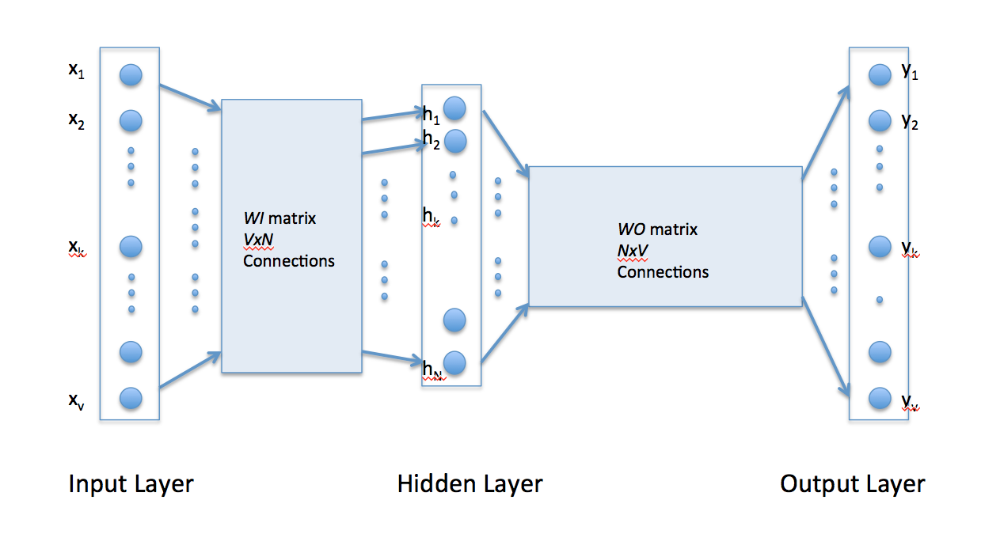
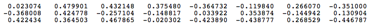
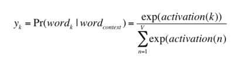
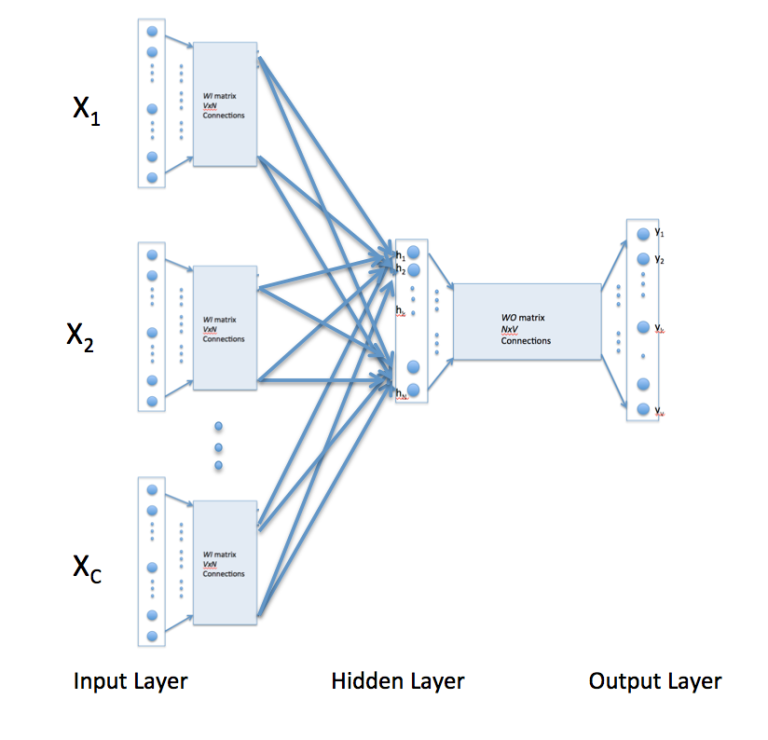

# 词向量模型

向量空间模型在信息检索中是众所周知的，其中每个文档被表示为向量。 向量分量表示文档中每个单词的权重或重要性。 使用余弦相似性度量来计算两个文档之间的相似度。

虽然使用向量表示单词的想法已经存在一段时间了，但是将词映射到向量的技术——单词嵌入，最近开始流行起来。这种技术的一种驱动程序是[TomášMikolov的Word2vec算法](https://code.google.com/p/word2vec/)，它使用大量的文本来创建对单词的高维（50到300维）表示，从而得到单词之间不受外部注释影响的关系。这种表示方法似乎能捕捉到许多的语言规律。

Word2vec使用单个全连接神经网络作为隐藏层，如下图所示。隐藏层中的神经元都是线性神经元。输入层被设置成含有用于训练的词汇表中的单词一样多的神经元。隐藏层的大小被设置为得到的字向量的维度。输出层的大小与输入层相同。因此，假设用于学习字向量的词汇由V单词构成，N为的词向量的维度，则隐藏层的输入可以用大小为VxN，每行代表一个单词的矩阵WI表示。同样，从隐藏层的输出可以用大小为NxV，每列代表给定单词的矩阵WO表示。网路的输入使用“1-out-of-V”编码，即只有一条输入线为1，其他为0.

要更好地掌握Word2vec如何工作，请考虑具有如下句子的训练语料库：

> ”狗看见一只猫“，”狗追猫“，”猫爬树“

语料库词汇有8个字。一旦按字母顺序排列，每个单词都可以用索引来引用。对于这个例子，我们的神经元网络中将有8个输入神经元和8个输出神经元。我们假设在隐藏层中使用3个神经元，这意味着WI和WO分别为8x3和3x8的矩阵。在训练开始前，这些矩阵被初始化为较小的随机值。为了说明方便，我们假设WI和WO被初始化为以下值：

WI=

WO=

假设我们希望网络学习”猫“和”爬“之间的关系。也就是说，当”猫“输入到网路时，网络应该显示”爬“的可能性很高。在词嵌入的术语中，单词”猫“被成为上下文单词，并将单词”爬“称为目标单词。在这种情况下，输入矢量X将为`[0 1 0 0 0 0 0 0]^t`。请注意，只有向量的第二个分量是1，这是因为输入的单词是”猫“，它在语料库单词的排序列表中保持第二个位置。给定目标单词”爬“，目标矢量将为`[0 0 0 1 0 0 0 0 ]^t`。

输入向量代表”猫“，隐藏层神经元的输出可计算为`H^t = X^t*WI = [-0.490796 -0.229903 0.065460]`。隐藏层的神经元的输出向量H由于1-out-of-V表示法而和和WI矩阵的第二行相似。所以隐藏层输入的功能基本上是将输入的单词向量拷贝到隐藏层。对隐藏层输出作相同的的操作，输出层的激活向量可以写作`H^t*WO = [0.100934  -0.309331  -0.122361  -0.151399   0.143463  -0.051262  -0.079686   0.112928]`。

由于目标是为输出层中的单词产生概率，所以对于`Pr(word k|word context), k=1`，为了反映其与输入端的上下文单词的下一个单词的关系，我们需要将输出层中的神经元输出加到一起。Word2vec通过使用softmax函数将输出层神经元的激活值转换为概率来实现此目的。因此，第k个神经元的输出使用下面的表达式计算的，其中activation(n)表示第n输出层神经元的激活值。

因此，语料库中八个单词的概率是：

> 0.143073   0.094925   0.114441   0.111166   0.149289   0.122874   0.119431   0.144800

粗体的概率是选中的目标单词”爬“。给定目标向量`[0 0 0 1 0 0 0 0 ]^t`，可以通过从目标向量中减去概率向量的方法简单地计算输出层的误差向量。一旦知道了误差，就可以用反向传播更新矩阵WI和WO中的权重。因此，训练可以通过从语料库呈现不同的上下文词汇来进行。本质上，这是Word2vec学习词汇间的关系的方法。

## 连续单词（CBOW）学习

上述结构和描述是为了学习一对单词间的关系。在连续单词模型中，上下文由给定的目标词的多个单词表示。例如，我们可以使用”猫“和”树“作为“爬”的上下文单词作为目标单词。这需要调整神经网络的结构。调整如下图所示，包括将输入到隐藏层的连接重复C（上下文单词的数量）次，以及在隐藏层中添加一个除以C的操作。

通过上述配置来指定C个上下文单词，每个单词都用1-out-of-V表示，意味着隐藏层的输出是输入出的上下文单词的单词向量的平均值。输出层保持不变，训练以之前讨论过的方式进行。